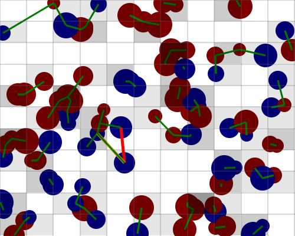

# go-supreme-pancake - Nearest Neighbor using svgo 
Go webserver serving SVG images demonstrating grid-based nearest neighbor calculation using [ajstarks/svgo](https://github.com/ajstarks/svgo) to generate SVG images.

Example with 100 bodies with green lines between nearest neighbors, calculated using both brute force `O(n^2)` calculations as well as grid based `O(nd)` calculations

The orange and red lines show a mismatch where grid based falsely chooses a neighbor in a cell vs true distance. This is because we're naively placing bodies within cells disregarding radii, the next step will be to place bodies in all cells they overlap, resolving mismatches and reducing overall computation needed.

We can do better than O(n^2) for nearest neighbor calculation.One way is to grid up the space into cells, in one `O(n)` pass populate the cells with the indices of bodies overlapping that cell.

The cell size is determined as the max radius of a body, meaning a body will never overlap more than 2 cells in any direction. 

Then, in another `O(n)` pass we check each body with the adjacent cells, roughly`n*d` calculations where d is the average density of the space. From this in the average and best case we approach `O(n)` calculations, with a worst case `O(n^2)` when all bodies are within 1 cell of each other, which would call for a better grid.

## Install

To install:

    $> go install github.com/Elucidation/go-supreme-pancake

## Run

To run, if you installed Go in the default directory just call `go-supreme-pancake`, otherwise run:
  
    $> $GOPATH/bin/go-supreme-pancake

    Starting Server on http://localhost:2003
      Try going to http://localhost:2003/brute

## Dependencies

    go get github.com/ajstarks/svgo